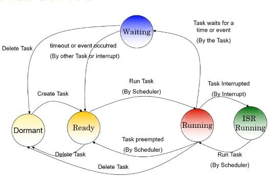
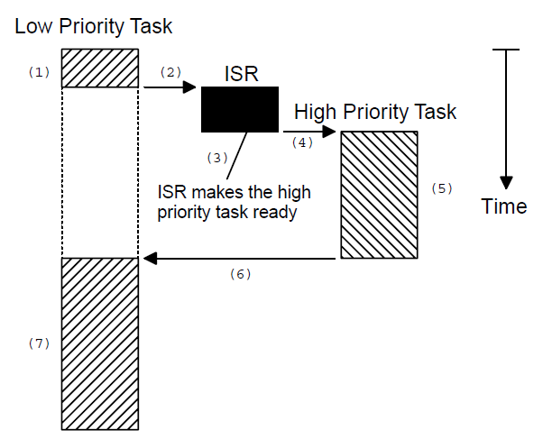
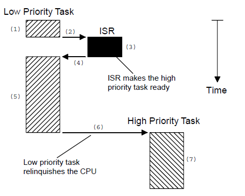
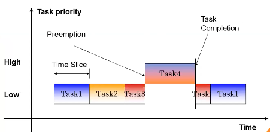

# RTOS-notes


The Operating System is a system which takes number of Tasks and perform them in a specific time called Periodicity.

Task is nothing but a piece of code that repeated every specific time. Every task has its own periodicity . The OS will Synchronize between these task Simply.

> Real-Time system is a system that respond to external event in a timely fashion

Real-Time system is a software system which the correct functioning of the system depends on the results produce by the system and the time which those results are produced
## RTOS
Real-time operating systems (RTOS) are used in environments where a large number of events, mostly external to the computer system, must be accepted and processed in a short time or within certain deadlines. such applications are industrial control, telephone switching equipment, flight control, and real-time simulations. With an RTOS, the processing time is measured in tenths of seconds. This system is time-bound and has a fixed deadline. The processing in this type of system must occur within the specified constraints. Otherwise, This will lead to system failure.

### Examples of real-time operating systems

1. airline traffic control systems 
2. Command Control Systems
3. airline reservation systems 
4. Heart pacemakers 
5. Network Multimedia Systems
6. Robots.

### Types of RTOS 
There're 2 famous types the last two's not widely common

1. **Hard Real-Time Operating System**: _These operating systems guarantee that critical tasks are completed within a range of time._

For example, a robot is hired to weld a car body. If the robot welds too early or too late, the car cannot be sold, so it is a hard real-time system that requires complete car welding by the robot hardly on time., scientific experiments, medical imaging systems, industrial control systems, weapon systems, robots, air traffic control systems, etc.

2. **Soft real-time operating system**: _This operating system provides some relaxation in the time limit._

For example – Multimedia systems, digital audio systems, etc.

3. **Firm Real-time Operating System**: _is a middle ground between hard and soft RTOS types, RTOS of this type have to follow deadlines as well_.

In spite of its small impact, missing a deadline can have unintended consequences, including a reduction in the quality of the product.

Example: Multimedia applications.

4. **Deterministic Real-time operating System**: _timing must be permanently precise , Consistency is the main key in this type of real-time operating system. It ensures that all the task and processes execute with predictable timing all the time_

which make it more suitable for applications in which timing accuracy is very important. Examples: INTEGRITY, PikeOS.

### RTOS in layered architecture

| App      |
| -------- |
| RTOS     |
| Hardware |

### RTOS services

- Task management
- Inter-task communication
- Device I/O supervisory
- Dynamic memory allocation
- Timers

### RTOS advantages

- **Reliability** _Real time operating systems, especially those which are of hard RTOS are completely free of errors. It ensures a better way of handling errors. Besides, operating systems experience an issue known as jitter in which the amount of errors between subsequent loops is measured. If programmed correctly, a RTOS can be optimized in a way that it undergoes less amount of jitters._
    
- **Predictability** _A task can be predictable in time that it will be served and how much time and memory can be used for each task_
    
- **Performance** _Increases performance of timing and memory_
    
- **Compactness**
    
- **Scalability** _Can be run for many compilers and targets with the same source code_

## Multitasking
is a process of scheduling and switching the Central processing unit (CPU) between several tasks . A single CPU switches its attention between several sequential tasks Application programs are typically easier to design and maintain if multitasking is used.

## Task, or also called a thread, 
is a simple program that thinks it has the CPU all to itself. Task is a function which Takes void and returns void only contains some lines of codes. Every task could be periodic task .

Tasks have main three parameters:

1. **Function** (pointer to function) _The lines of code that will be executed by CPU._
    
2. **Periodicity** _The periodic time of the task to be executed._
    
3. **Priority** _the more importance the task , the higher priority given to it ._
    

a Task my be repsented as

```
typedef struct
{
    u8 periodiety;
    u8 priority;
    void *(Fptr)(void);
}Task;
```

### Task States:

1. **Dormant** _Task that resides in memory but has not been passed to the RTOS to start scheduling._
    
2. **Ready** _Task that can execute but its priority is less than the currently running task_
    
3. **Running** _Task that has the control of CPU._
    
4. **Waiting** _Task that requires the occurrence of an event.(for ex “waiting for an I/o operation”)_
    
5. **ISR** _When an interrupt has occurred and the CPU is in the process of service the interrupt_
    



### Task in RTOS

> each task has its own TCB (Task Control Block) that stores stack pointer and stack size for task 

> RTOS is not about concurrency but a pseudo concurrent execution

Each task is being executed for a small time slot then the processor switches to the other task

This operation occurs with a very fast rate giving the impression that these tasks are being executed at the same time

Task is typically an infinite loop (background)

each task sees the CPU as it's the only task running on the system

This requires that each task should have its own context (values of CPU registers)

each task should have its own stack

Task's context is stored in its stack when the task is not running

task's context should be popped in CPU registers when it starts running

### Task data
the data need to be save on context switching
1. General purpose registers (GPRs)
2. status register
3. Program counter
4. Stack pointer

on context switching the data saved is (pushed in sequence)
1. PC
2. R0
3. SREG
4. R1 
5. .
6. .
7. R31
Then store stack pointer in Task control block TCB


### Types of tasks

1. **Initialization task:** _executed only at the initialization of the system 
example: initialize peripherals_

2. **Cyclic task:** _once created it executes with a fixed periodicity._

3. **Event based task:** _executed only if a specific event has occurred, this tasks is not triggered by interrupts_

4. **Interrupt based task:** _executed only if a specific event has occurred, this tasks is triggered by interrupts however it's not preferred to be executed in the ISR_

### Priorities
There are 2 types of priority
1. **Task priority**
2. **Interrupt priority**

A priority is assigned to each task . the more importance the task , the higher
priority given to it .

There are 2 types of task priority
1. **Static priority:** _Task priorities are static when the priority of each task does not change during the execution time . Each task is given a fixed priority at a compile time._
2. **Dynamic priority:** _Task priorities are dynamic if the priority of the task can be change during the run time this feature is used is used in Real-time kernel to avoid priority inversion(will discussed later)_


Multitasking operation is accomplished by scheduling processes for execution independently of each other. Each process is assigned a certain level of priority that corresponds to the relative importance of the event that it services. The processor is allocated to the highest-priority processes. This type of schedule, called, priority-based preemptive scheduling is used by real-time systems.


## Kernal

A kernel is the part of multitasking system that software which responsible for management of tasks (managing the CPU time) and communicate between them.

The use of Real-time Kernel Simplify the design of the system by allowing the application to be divided into multiple tasks that the kernel manages.

### Scheduler
Scheduler : also called dispatcher , is the part of the kernel responsible for determining which task runs next.

Most Real time Kernel are priority passed.

Each task is assigned a priority based on it’s importance.

the priority of every task is application specific.

In a priority based kernel ,control of the CPU is always given to the highest priority task ready to run .

The Scheduler runs every a specific time called TICK time.

Tick time is that time which the Scheduler takes place.
Tick time must be suitable for all tasks.

Example:-
Consider that we have a scheduler with Tick time (1ms) and we have three tasks will run at next Tick every one of them takes 500us to be performed .

The scheduler will ignore the third task As if it did not exist and perform another one at next tick and that is a Disaster

CPU load is one of the most important parameters in the OS .

CPU load is that how much is the CPU busy between two ticks.

CPU load could be determined by a simple equation.

CPU Load = sum(Execution time in the worst case) / tick time

CPU load have to be less than 100%.

The lower the CPU load the better the system

It is better for a CPU load to be between 60% and 80%.

The tick time must be greater than the greatest execution time of a task.

### Priority Based Kernal Types

Two types of priority based kernel exist:
1. Preemptive kernel

A preemptive kernel is used when system responsiveness is important. 
The highest priority task ready to run is always given control of the CPU .
The most commercial Real time Kernels are preemptive .


If the ISR a higher priority task ready , when the ISR completes , the interrupt task is suspended, and the new higher priority task is resumed.



2. Non-preemptive Kernel


Non-preemptive kernel requires that each task does something to explicitly give up control of the CPU

The ISR can make a higher priority task ready to run , but the ISR always returns to the interrupted task. The new higher priority task gains control of the CPU only when the current task give up the CPU



> What happens when there is two or more tasks with the same priority ? Move to Round-Robin algortihm

### Scheduling algoritms

1. **Priority-based:** Scheduliing process based on their priority. The process with higher priorty should carry out first, whereas jobs with equal priority are carried out on around-robin or FCFS basis

2. **Round-robin:** Round robin is the oldest, simplest scheduling algorithm. The name of this algorithm comes from the round-robin principle, where each person gets an equal share of something in turn. It is mostly used for scheduling algorithms in multitasking. This algorithm method helps for starvation free execution of processes. Each task takes a time slot equally with other tasks



3. **First come first serve (FCFS):** the simplest algortithm. the first task that requests the CPU first get allocated first

4. **Shortest remaining time (SRT):** Also known as Shortest job first preemptive scheduling. In this method, the process will be allocated to the task, which is closest to its completion. This method prevents a newer ready state process from holding the completion of an older process.

5. **Shortest job first (SJF):** is a scheduling algorithm in which the process with the shortest execution time should be selected for execution next This scheduling method can be preemptive or non-preemptive. It significantly reduces the average waiting time for other processes awaiting execution.


## Critical section and Shared resource

### Critical section 

Code segment which need to be treated indivisibly .After a section of code starts executing ,it must not be interrupted.

Interrupt are typically disabled before critical section is executing and enabled when the critical code is finished

### Shared resource
A shared resource is a resource that can be used by more than one task. 

Each task should gain exclusive access to the shared resources to prevent data corruption.

Imagine what would happen if two tasks were
allowed to send characters to a printer at the
same time. The printer would contain inter-leaved
data from each task. For instance, the printout
from Task 1 printing “I am Task 1!" and Task 2
printing “I am Task 2!" could result in:
I la amm T Tasask kl !2!


### Semaphore

A semaphore is a kernel object that one or more
threads of execution can acquire or release for
the purpose of synchronization or mutual
exclusion.
In this case, use a semaphore and initialize it to 1
(binary semaphore). The rule is simple: to access
the printer, each task first must obtain the
resource’s semaphore.